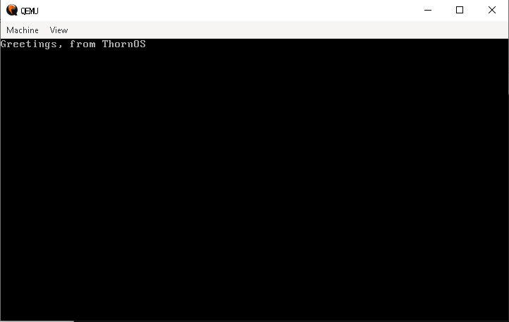

# ThornOS

The operating system project. Built from scratch in assembly and a custom programming language.



## Components

### ThornASM (`thornasm/`)
64-bit x86-64 assembler. Compiles `.tsm` assembly source to flat binary or ELF executables.

```
python thornasm/assembler.py source.tsm output.bin --bin
```

### SoftRose (`softrose/`)
SoftRose programming language compiler. Compiles `.rose` source to ThornASM assembly, then assembles to binary.

```
python softrose/softrose.py hello.rose hello.bin
```

### OS (`os/`)
Bootloader written in ThornASM. Prints "Greetings, from ThornOS" on boot.

```
python os/build.py
qemu-system-x86_64 -fda ThornOS.img
```

## SoftRose Language

```rose
task add(x, y) {
    send x + y
}

task start() {
    result = add(3, 4)
    write("3 + 4 = 7\n")

    i = 0
    loop(i < 5) {
        i = i + 1
    }

    if (result == 7) {
        write("math works!\n")
    } else {
        write("math broken!\n")
    }
}
```

## Build Stack

```
SoftRose (.rose) -> ThornASM (.tsm) -> x86-64 binary
```
